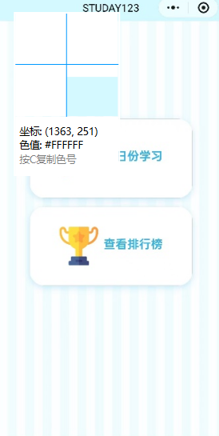

## 2.3 原型系统设计

### 2.3.1 登录与初始界面原型

登录与初始界面（图2-7）是用户接触系统的第一道入口，设计核心为 “简洁、便捷、低门槛”。

功能设计：提供微信快捷登录与游客模式两种访问方式，游客模式无需授权即可快速体验核心功能；  
界面设计：采用简洁布局，以大尺寸按钮呈现 “登录”“游客模式” 选项，搭配浅色系背景，符合儿童审美；  
交互逻辑：点击 “登录” 跳转至微信授权页面，授权后自动进入系统首页（图2-8）；点击 “游客模式” 直接进入选题流程，减少操作步骤。

功能设计：提供 “启动学习”“查看排名” 的快捷入口，直接触达核心功能；  
界面设计：采用卡片式布局，搭配卡通图标（数字 123、奖杯），增强趣味性；底部设置 “答题”“个人” 导航栏，逻辑清晰；  
交互逻辑：点击 “今日份学习” 进入数学模块选择界面，点击 “查看排行榜” 跳转至排名页面，点击导航栏切换功能模块。

### 2.3.2 数学模块原型

功能设计：提供 “做新题”“错题复习”“收藏管理” 的分类入口，覆盖 “学 - 练 - 复习” 全流程；  
界面设计：如图2-9，采用按钮 + 图标组合的布局，文字清晰、图标直观（灯泡、循环箭头、星星），降低理解成本；  
交互逻辑：点击 “做新题” 进入年级与题目数量选择界面，点击 “错题重做” 直接启动错题练习，点击 “收藏” 查看已收藏题目。

功能设计：界面展示题目内容，提供大尺寸输入框供儿童填写答案，支持 “下一题”“提交” 等操作；  
界面设计：如图2-10，题目区域采用大字体展示，输入框尺寸放大，避免操作误触；  
交互逻辑：填写答案后点击 “下一题” 继续答题，点击 “提交” 结束当前练习并生成结果报告。

功能设计：展示答题得分、错误题目序号，提供 “查看错题”“返回首页” 的操作选项；  
界面设计：如上图2-11，得分以醒目字体呈现，搭配鼓励性文字（“别灰心，继续努力哦！”），保护儿童学习积极性；  
交互逻辑：点击 “点击查看” 跳转至错题详情页，点击 “返回数学首页” 回到模块选择界面。

### 2.3.3 错题与收藏原型

错题与收藏功能是帮助儿童针对性复习的核心模块，原型设计需突出 “便捷查看、快速重做” 的核心需求。

功能设计：按年级分类展示错题，包含题目内容、正确答案，支持 “移除” 操作；  
界面设计：如图2-12所示，采用列表式布局，每条错题独立成项，正确答案用醒目颜色标注，便于对比记忆；  
交互逻辑：点击 “重做” 直接进入该题的答题界面，点击 “移除” 将错题从列表中删除，支持个性化管理。

功能设计：提供 “学习记录查看”“系统设置” 的入口，支持用户信息管理；  
界面设计：如图2-15，采用图标 + 文字的组合方式，功能入口清晰（下载图标对应学习记录、齿轮图标对应设置）；  
交互逻辑：点击 “学习记录” 查看答题数量、时长、正确率等详细数据；点击 “设置” 进入系统配置页面。

### 2.3.6 原型设计验证

上述原型界面均基于用户需求与系统核心目标设计，通过以下维度验证其合理性：  
需求匹配度：所有原型界面均对应表 2-1 中的用户需求，如答题界面满足儿童 “简单操作、即时反馈” 需求，学习记录功能满足家长 “监督学习进度” 需求；  
易用性：界面设计简洁直观，操作流程简化（核心操作不超过 3 步），符合儿童与家长的使用习惯；  
趣味性：采用儿童友好的配色、图标与鼓励性文字，避免学习过程的枯燥感，提升儿童学习主动性；  
一致性：各模块界面风格、交互逻辑保持统一，降低用户学习成本，提升整体使用体验。

通过原型系统设计，将抽象的需求转化为可视化的界面与交互流程，为后续开发工作提供了明确的参考标准，同时便于提前收集用户反馈，及时优化调整，保障最终产品符合用户预期。
