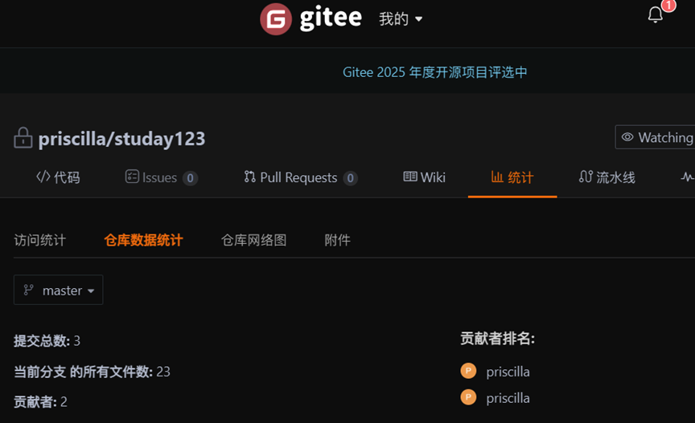
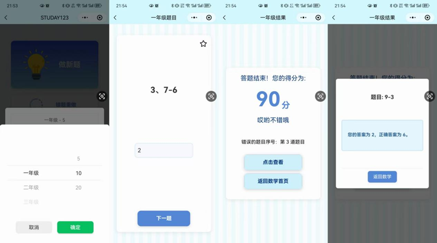
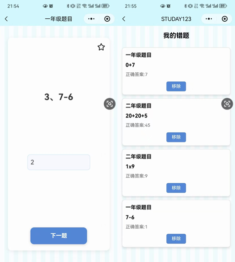
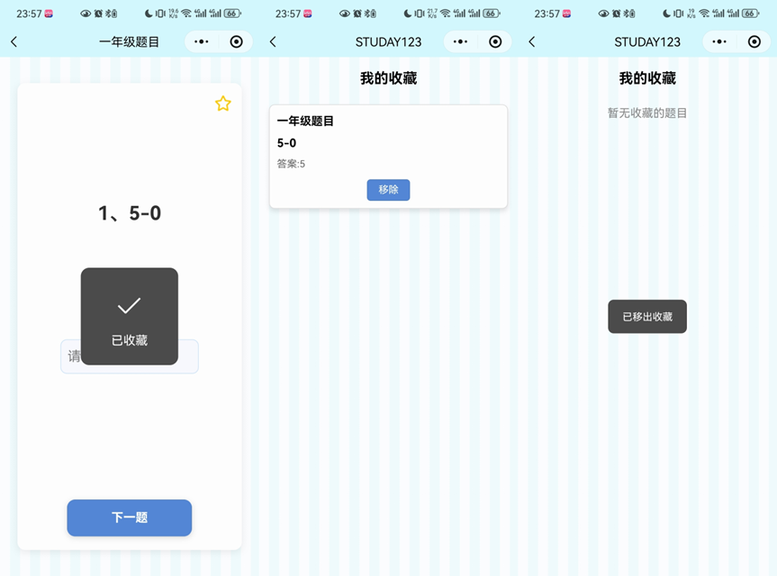
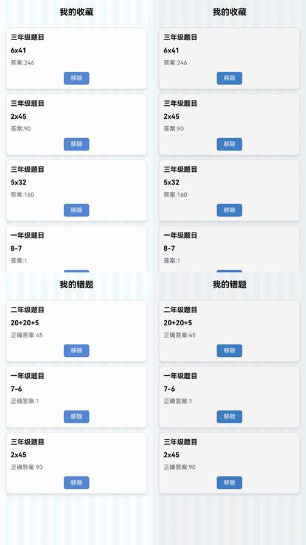
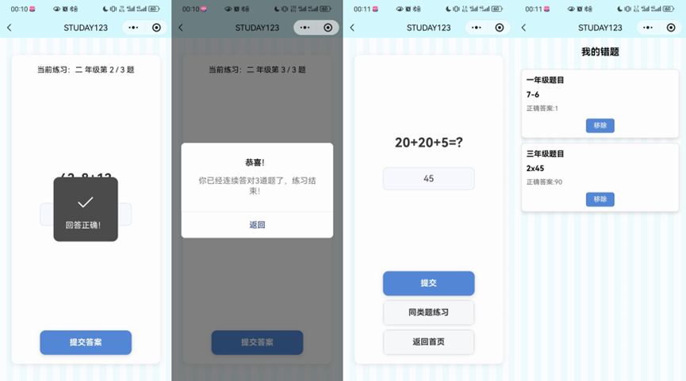
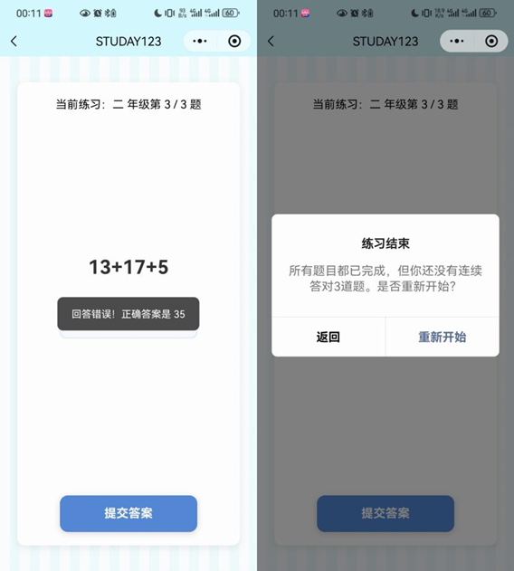

# 1 实现与测试

## 1.1 实现环境与代码管理

### 1.1.1 实现环境
- **开发工具**：微信开发者工具 (WeChat DevTools)  
- **编程语言与技术栈**：  
  - 前端：JavaScript (逻辑层)、WXML (结构层)、WXSS (样式层)、JSON (配置层)  
  - 后端：微信云开发 (Cloud Base) 提供的云函数 (Cloud Functions) 和云数据库 (Cloud Database)  
- **操作系统环境**：Windows 10  
- **核心技术**：充分利用微信云开发能力，实现前后端一体化开发，简化服务器搭建和维护，使数据存储、业务逻辑处理更加高效便捷。

### 1.1.2 代码管理

- **版本控制系统**：团队采用 Git 作为版本控制系统，确保代码版本可追溯、可管理。  
- **代码托管平台**：代码托管在 Gitee，便于协同开发、代码审查和问题追踪。  
- **分支管理策略**：遵循 Git Flow 分支策略：
  - `master`：稳定版本发布  
  - `develop`：集成开发  
  - `feature`：功能模块开发  
  确保开发流程规范与稳定。

---

## 1.2 关键函数说明

1. **generatePracticeQuestions（前端核心算法 - 题目加载与筛选）**  
   - 功能描述：根据年级从云端题库中筛选题目并随机生成练习。  
   - 输入参数：`grade`, `count=10`  
   - 输出：包含指定数量题目的数组。  
   - 数据交互：从 `globalData` 获取题库，处理后返回给练习页面渲染。

2. **checkAnswer（前端核心算法 - 答案校验）**  
   - 功能描述：比较用户输入与正确答案是否一致。  
   - 输入参数：`question`, `userAnswer`  
   - 返回：`boolean`（true 表示正确，false 表示错误）。  
   - 数据交互：更新 UI 并调用 `submitPracticeRecord` 云函数提交结果。

3. **recordWrongQuestion（前端核心算法 - 错题记录）**  
   - 功能描述：将答错的题目保存至本地错题本缓存。  
   - 输入参数：`question`, `userAnswer`  
   - 数据交互：使用 `wx.setStorageSync` 更新本地存储。

4. **submitPracticeRecord（云函数 - 练习记录与排行榜更新）**  
   - 功能描述：保存练习结果并更新排行榜。  
   - 输入参数：`openid`, `questionId`, `isCorrect`, `scoreChange`  
   - 返回：操作结果。

5. **toggleFavoriteQuestion（云函数 - 收藏题目）**  
   - 功能描述：用户添加或移除收藏。  
   - 输入参数：`questionId`, `openid`, `action(add/remove)`  
   - 返回：操作结果。

6. **getLeaderboardData（云函数 - 获取排行榜数据）**  
   - 功能描述：获取排行榜前 N 名及当前用户排名。  
   - 返回：包含排行榜数据和当前用户信息的对象。

7. **login（云函数 - 获取用户 OpenID）**  
   - 功能描述：获取微信用户唯一标识 openid。  
   - 返回：`openid`, `appid`, `unionid`。

---

## 1.3 测试计划和测试用例

### 1.3.1 常用软件测试方法
常见测试方法：

- **单元测试**：验证最小功能单元正确性。  
- **集成测试**：测试模块间接口。  
- **系统测试**：验证系统是否满足需求。  
- **验收测试**：由用户确认系统性能与功能。

本项目采用 **黑盒测试** 进行系统功能验证，结合 **等价类划分** 与 **边界值分析** 设计测试数据。

---

### 1.3.2 练习模块测试
**设计目标**：准确性、随机性、合理性、交互友好性、数据完整性。

**测试用例 1：正常流程——一年级 10 道加法题**

**测试步骤：**
1. 登录小程序，进入“今日学习”。  
2. 选择“一年级”，题目数量“10”。  
3. 开始练习并完成所有题目。  
4. 检查结果页与错题记录。

**预期结果：**
- 成功生成题目。  
- 答题流畅，统计准确。  
- 错题被正确记录。

---

### 1.3.3 错题集与收藏集测试
**设计目标**：准确性、数据完整性、学习闭环、数据同步。

**测试用例 2：错题自动收集与信息完整性验证**
- 故意答错题目后，进入“错题集”页面。
- 错题应被完整记录并显示详细信息（原题、错误答案、正确答案、时间等）。

**测试用例 3：题目的收藏与取消收藏**
- 点击题目“收藏”按钮后应即时反馈。  
- 收藏列表显示同步更新；取消收藏后题目消失。

**测试用例 4：错题与收藏数据的跨设备同步**
- 在设备 A 产生错题与收藏；  
- 在设备 B 登录同账号；  
- 错题与收藏数据应保持一致。

---

### 1.3.4 错题重做与同类题练习测试
**设计目标**：强化薄弱点、量化掌握、形成学习闭环。

**测试用例 5：成功完成错题重做与同类题练习闭环**
- 错题重做正确后提示进入同类题练习。  
- 连续答对 3 道后提示掌握并移除错题。

**测试用例 6：同类题练习中途答错**
- 答错后系统提示重新练习巩固知识点。

---

### 1.3.5 排行榜模块测试
**设计目标**：数据准确性、隐私安全性、性能与容错性。

**测试用例 7：排行榜排名逻辑准确性验证**
- 答题正确数超过上一名后排名上升；  
- 同分时根据时间顺序排序。

---

## 1.4 结果分析
**测试结果汇总：**

| 测试用例 | 执行结果 | 是否达标 |
|-----------|------------|------------|
| 测试用例1 | 功能正常 | ✅ |
| 测试用例2 | 功能正常 | ✅ |
| 测试用例3 | 功能正常 | ✅ |
| 测试用例4 | 功能正常 | ✅ |
| 测试用例5 | 功能正常 | ✅ |
| 测试用例6 | 功能正常 | ✅ |
| 测试用例7 | 功能正常 | ✅ |

