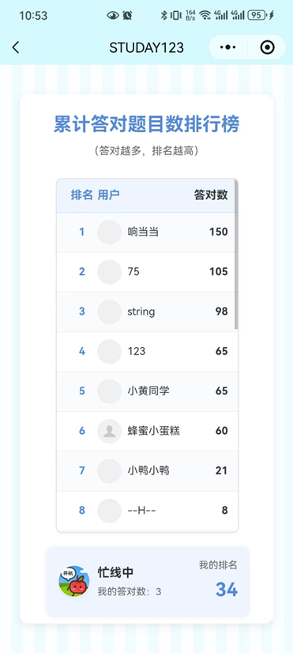
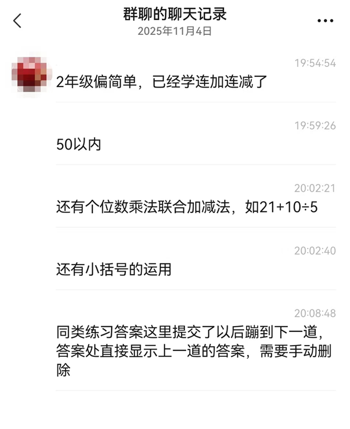

# 用户使用记录与反馈

通过收集和分析部分用户在使用过程中的反馈，可以归纳出以下几个方面的意见与建议：

1. **题目难度与年级匹配性**  
   部分用户反馈二年级的题目偏简单，建议根据学习进度动态调整难度，例如增加连加、连减和进位运算等综合性题型。

2. **题目范围和内容多样性**  
   用户希望练习范围可自定义，如“50以内”的加减法，或增加个别混合题型（例如个位数乘法与加减结合的题，如“21 + 10 ÷ 5”）。  
   此外，部分用户提到希望增加“小括号运算”的题型，以提升运算思维训练的层次。

3. **交互与操作体验优化**  
   用户在同类题练习过程中反馈，提交答案后会直接跳转到下一题，但答案输入框中仍保留上一题答案内容，需要手动清除，建议在跳转时自动清空输入框。

4. **功能完善与学习连贯性**  
   部分用户建议在练习完成后能直接查看错题解析或相关知识点讲解，从而在练习后获得即时学习反馈。  
   另有用户希望能在排行榜中查看个人的进步趋势图，以更直观地感受到学习成果。

