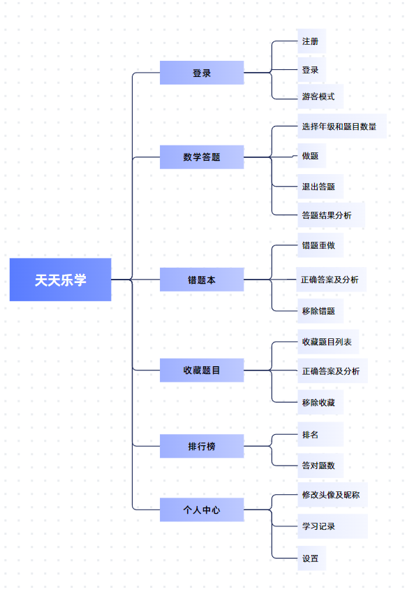

# 儿童口算学习小程序第一次会议记录

* **参会者**：马歆喆，吴梦瑶，吕明优，张志娟  
* **时间**：2025年10月29日（周三） 南一楼808教室

---

## 项目选择
基于微信平台的儿童口算学习小程序  
（轻量化、趣味化、家长可监督）

### 1. 主要技术栈
**分成前端与后端开发**

**前端**：基于微信小程序框架（WXML、WXSS、JavaScript），实现答题界面、排行榜、错题本、学习记录等模块。  

**后端**：采用微信云开发（Cloud Functions + 云数据库），支持用户管理、题库数据处理、学习记录存储、个性化推荐算法等核心逻辑。  

**数据库**：云数据库（user、record、question、analysis 四类数据表）。  

---

### 2. 团队分工

**项目统筹与规划**：马歆喆  
- 负责 NABCD 模型设计、需求分析、整体规划与进度控制。  

**产品设计与交互优化**：吴梦瑶  
- 负责页面原型、交互流程、趣味化视觉设计及用户体验优化。  

**技术开发与系统实现**：吕明优  
- 负责题库模块开发、数据库设计、个性化推荐算法与功能实现。  

**测试与用户反馈**：张志娟  
- 负责测试用例设计、系统功能测试、收集反馈并优化产品。  

---

## 项目分析（头脑风暴）

### 1. 现有儿童学习系统的不足
>* 家长无法实时监督孩子学习，缺乏有效反馈机制。  
>* 产品功能繁杂、操作复杂，儿童上手困难。  
>* 存在广告、收费项目，影响学习专注度。  
>* 学习路径单一，缺乏趣味与互动设计。  
>* 数据管理混乱，学习记录无法追踪与分析。  

---

### 2. 改进方式

- [x] 基于微信小程序平台开发，无需安装、轻量化使用。  
- [x] 题目分级与个性化推荐算法，匹配不同年龄与学习水平。  
- [x] 家长端数据可视化，实时查看学习进度与错题分布。  
- [x] 去广告设计，保证纯净学习环境。  
- [x] 趣味化界面与积分奖励机制，增强学习动力。  
- [x] 自动清理闲置账号数据，优化系统性能与存储。  

---

### 3. 题目来源

* 依据小学数学教材核心知识点生成基础题库；  
* 结合历年试题与常见易错题扩充数据库；  
* 通过算法自动生成部分计算题以提高题目多样性；  
* 支持题库定期维护与人工审核，确保内容准确性。  

---

### 4. 需求

* **注册与登录** —— 支持儿童端、家长端及管理员账号管理。  
* **儿童端功能** —— 题目选择、答题练习、错题重做、题目收藏、排行榜。  
* **家长端功能** —— 查看学习记录（答题数量、时长、正确率）、错题分布、数据统计。  
* **管理员端功能** —— 用户数据管理、题库维护、系统监控与权限控制。  
* **数据管理** —— 支持学习记录存储、个性化推荐算法、数据可视化展示。  
* **平台设计** —— 无广告、简洁操作、跨端访问、自动数据清理。  

---

## 思维导图

---

## 会议图片

