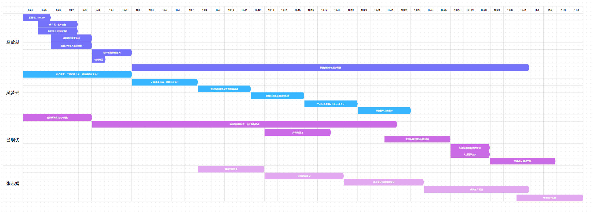

## 任务分解
任务安排:

### 需求分析与规划（第 1-2 周）
负责人：**马歆喆**  
1. 牵头团队完成 NABCD 模型细化  
2. 开展需求调研与可行性分析  
3. 输出需求规格说明书、UML 图等资料  
4. 确定总体技术方案  
5. 落地 NABCD 模型中的 “需求” 与 “方法” 环节  

---

### 设计阶段（第 3-4 周）
负责人：**吴梦瑶**（界面设计与交互原型）  
协作人：**吕明优**（数据库与数据结构）  
1. 完成小程序整体界面设计与交互原型制作  
2. 设计数据库表结构与核心数据模型  
3. 组织团队方案评审，确保符合 NABCD “竞争优势” 与 “技术要求”  
4. 确定开发规范、接口格式与代码命名标准  

---

### 开发阶段（第 5-10 周）
负责人：**吕明优**（核心功能开发）  
协作人：**吴梦瑶**（界面优化）  
1. 模块化开发登录、答题、个性化推荐等核心功能  
2. 每周召开例会同步开发进度  
3. 解决接口与数据交互中的技术问题  
4. 前后端联调，确保系统稳定性  
5. 落地 NABCD 模型中的 “方法” 实施部分  

---

### 测试与优化（第 11-12 周）
负责人：**张志娟**  
1. 组织全面功能与性能测试  
2. 验证核心功能正确性与用户体验  
3. 收集 50–100 组用户试用反馈  
4. 协调开发人员修复 Bug、优化交互体验  
5. 验证 NABCD 模型中的 “收益” 效果  

---

### 上线与迭代（第 13 周及以后）
负责人：**全体项目组成员**  
1. 提交小程序审核并上线运行  
2. 初期推广验证 NABCD 模型中的 “竞争” 优势  
3. 持续收集用户反馈并优化功能  
4. 计划 2–3 个月后与校方合作  
5. 用户规模超过 1 万后规划平台扩容  
6. 推进 NABCD 模型中的 “交付” 阶段  

---

## 进度安排
采用甘特图（图 1-1）规划整体进度，明确任务、节点与责任人，具体时间安排如下：

- **第 1–2 周**：需求分析与规划阶段（马歆喆牵头）  
- **第 3–4 周**：设计阶段（吴梦瑶、吕明优）  
- **第 5–10 周**：开发阶段（吕明优、吴梦瑶）  
- **第 11–12 周**：测试与优化阶段（张志娟）  
- **第 13 周及以后**：上线与迭代阶段（全体团队成员）

