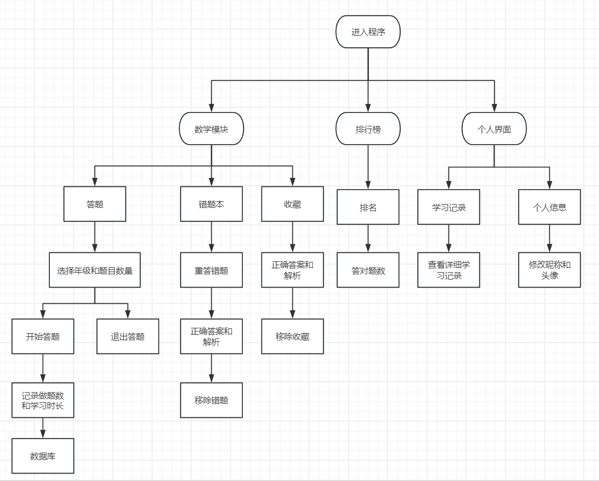
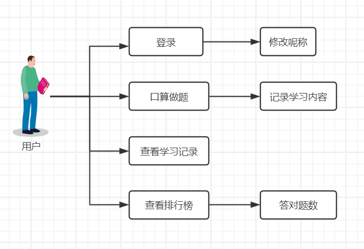
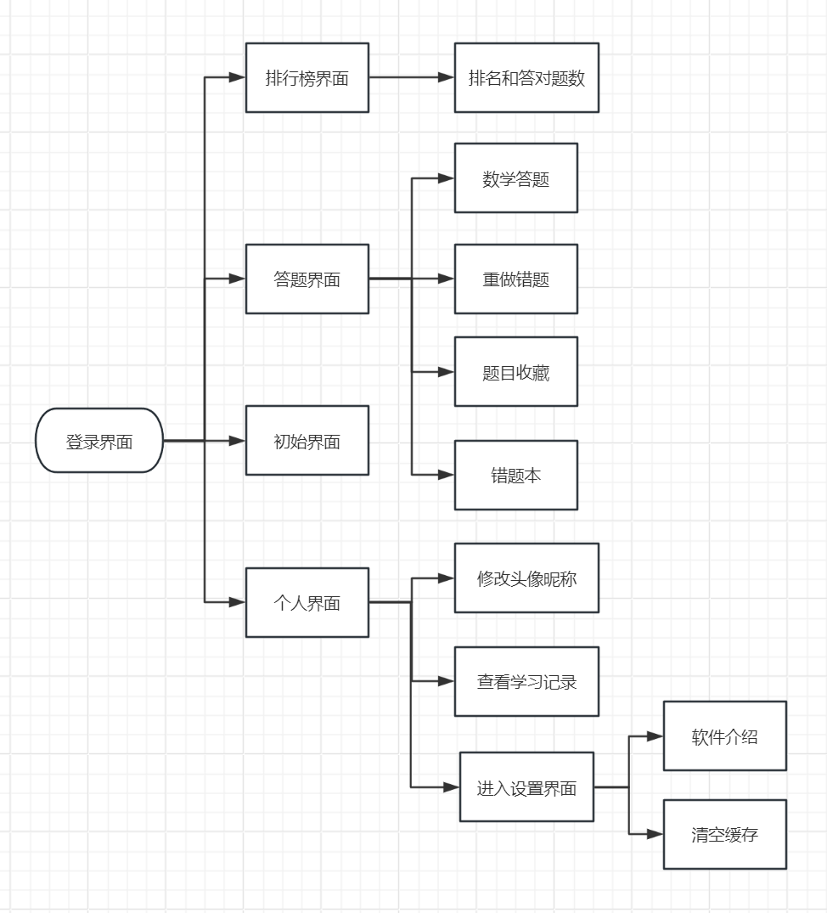
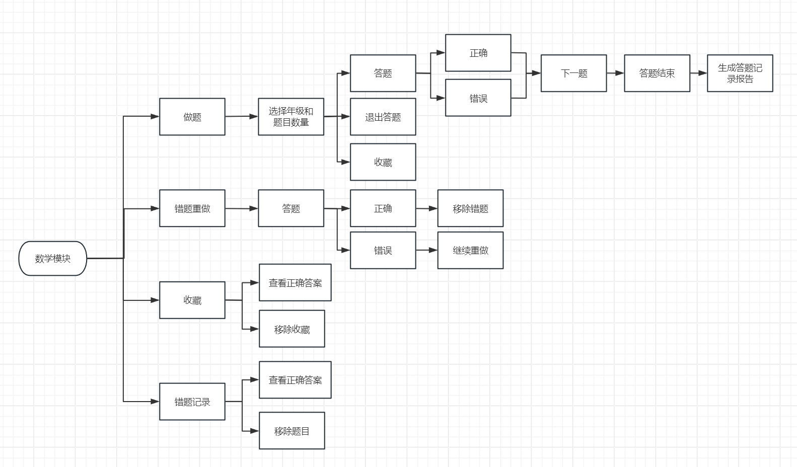

# 1 需求分析

## 1.1 需求分析概述
需求分析是项目开发的核心前置环节，旨在全面挖掘目标用户的核心诉求、明确系统功能边界与设计方向，为后续开发、测试及优化提供根本依据。  
本项目聚焦儿童口算能力提升，针对儿童、家长、管理员三类核心用户，结合现有儿童学习软件的痛点，通过调研分析梳理出功能需求与非功能需求，最终确立 **“趣味化学习、便捷化操作、透明化监督、系统化管理”** 的核心目标，构建 “学 - 练 - 评” 一体化的口算学习闭环。

---

### 1.1.1 目标用户需求梳理
通过对目标用户群体的行为习惯、核心诉求进行调研分析，明确各类用户的具体需求，如下表 **1-1** 所示：

**表 1-1 目标用户需求分析表**

| 用户类型 | 核心诉求 | 具体需求描述 | 对应系统功能 |
|-----------|-----------|---------------|---------------|
| 儿童用户 | 趣味化学习、简单操作、即时反馈 | 1. 界面直观简洁，无需复杂引导即可上手； 2. 学习过程融入互动元素，避免枯燥； 3. 答题后即时获得结果与解析； 4. 可收藏重点题目、重做错题； 5. 能查看自身答题排名，获得学习动力 | 1. 简洁登录 / 游客模式； 2. 年级与题目数量选择功能； 3. 即时答题反馈与答案解析； 4. 错题本、收藏题目功能； 5. 排行榜功能 |
| 家长用户 | 监督学习进度、掌握薄弱环节、便捷管理 | 1. 实时查看孩子学习记录（答题数量、时长、正确率）； 2. 明确孩子错题分布，便于针对性辅导； 3. 无需额外下载软件，使用门槛低； 4. 无广告干扰，保障学习专注度 | 1. 家长管理后台； 2. 学习记录详情展示功能； 3. 错题本同步查看功能； 4. 微信小程序载体； 5. 无广告设计 |
| 管理员用户 | 数据管理、系统维护、权限管控 | 1. 查看平台整体运营数据（用户数、答题量等）； 2. 管理用户信息，支持修改与记录； 3. 维护题目数据库，保障内容准确性； 4. 监控系统运行状态，处理异常问题 | 1. 后台数据统计功能； 2. 用户信息管理模块； 3. 题目数据库维护功能； 4. 系统权限管控功能 |

---

### 1.1.2 系统核心目标
基于上述用户需求，结合项目定位，本系统需实现以下核心目标：

- **功能完整性**：覆盖 “登录 - 选题 - 答题 - 反馈 - 复习 - 监督” 全流程，实现答题、错题重做、收藏、学习记录、排行榜等核心功能，满足不同用户的使用需求。  
- **体验便捷性**：采用直观简洁的界面设计与简化的操作流程，儿童用户可在 3 步内启动答题，家长与管理员无需专业知识即可熟练使用。  
- **学习高效性**：通过题目自动生成与数据库导入结合的方式，提供贴合教材的口算题目，配合错题本与解析功能，帮助儿童夯实数学计算基础。  
- **监督实时性**：搭建家长管理后台，同步展示孩子学习数据，让家长随时掌握学习动态，实现 “学 - 评” 联动。  
- **运行稳定性**：保障系统在多用户同时在线、高频答题场景下的流畅运行，数据存储安全可靠，支持闲置账号数据优化机制。

---

### 1.1.3 需求分析模型梳理
通过思维导图工具对需求进行结构化拆解，清晰呈现需求层级与关联关系，为系统功能设计提供明确指引，如 **图 1-1** 所示：

同时，结合系统功能图进一步明确需求落地的功能载体，系统功能图如下（**图 1-2**）：

---

## 1.2 UML 相关需求分析图
选取合适的 UML 图表准确说明用户需求，明确系统要实现的目标。

---

### 1.2.1 用例图
用例图用于描述系统参与者与系统功能之间的交互关系，明确不同用户在系统中的操作权限与使用场景。  
本项目用例图如 **图 1-3** 所示：

- **用户参与者**：核心用例包括登录 / 注册、修改昵称、口算做题、查看学习记录、查看排行榜、收藏题目、错题重做、查看正确答案等，全面覆盖儿童与家长的核心操作需求，其中家长用户可通过 “查看学习记录” 用例实现监督功能。  
- **管理员参与者**：核心用例包括查看后台数据、用户信息管理、权限管控、题目数据库维护等，体现了管理员对系统的运营与维护需求。  
- **用例关系说明**：“口算做题” 是核心用例，与 “收藏题目”“错题重做”“查看正确答案” 存在关联关系，“答题结束” 后触发 “生成答题记录报告” 用例，形成完整的学习闭环，符合用户 “学 - 练 - 评” 的需求逻辑。

---

### 1.2.2 系统组织图
系统组织图用于展示系统的模块划分、层级结构及模块间的关联关系，明确系统的功能架构设计。  
本项目系统组织图如下（**图 1-4**）：

- **一级模块**：包括数学模块、排行榜、个人界面三大核心模块，对应系统核心功能方向。  
- **二级模块**：每个一级模块下细分具体功能模块，如数学模块包含答题、错题本、收藏功能；排行榜模块包含排名展示与答对题数统计；个人界面包含学习记录、个人信息修改、设置功能。  
- **三级模块**：进一步细化操作流程，如答题模块下包含 “选择年级和题目数量”“开始答题”“退出答题” 等操作；错题本模块包含 “重答错题”“查看正确答案和解析”“移除错题” 等功能。  
- **数据支撑**：所有模块均与数据库建立关联，实现题目数据、用户数据、学习记录数据的存储与调用，保障系统功能的正常运行。

---

### 1.2.3 关键功能模块图
活动图用于清晰呈现系统功能的执行流程与交互逻辑。  
本图为数学模块活动图，直观展示了数学模块下 “做题、错题重做、收藏、错题记录” 四大核心功能的操作流程，如 **图 1-5** 所示：

